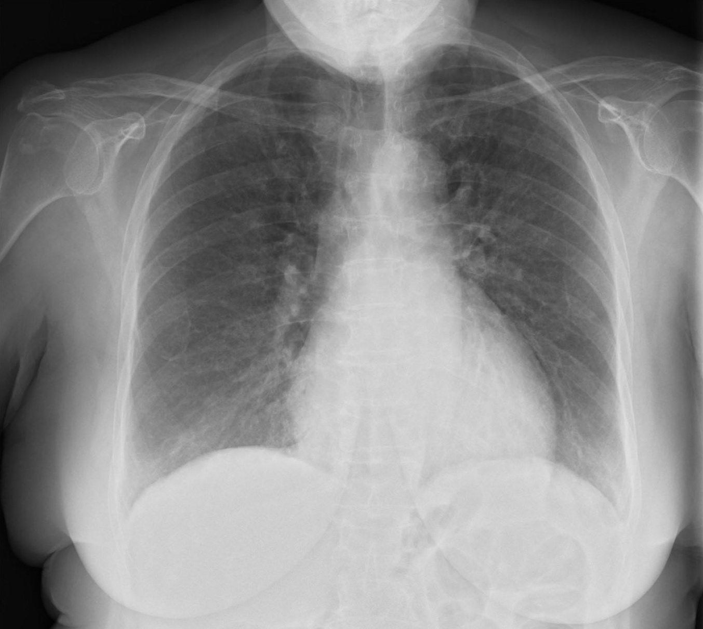

# AutoMedX


## Cardiovascular Disease Detection

The Cardiovascular Disease Detection project is an ambitious initiative aimed at developing a robust Machine Learning model using Convolutional Neural Networks (CNNs). This project focuses on accurately identifying and classifying four types of chest X-ray images: Pneumonia, COVID-19, Tuberculosis, and Normal cases. By leveraging cutting-edge technology, this project aims to assist healthcare professionals in achieving early and precise diagnoses, leading to timely interventions and improved patient outcomes.





## Objective

- **Develop** a state-of-the-art Machine Learning model using CNNs for accurate classification of chest X-ray images.
- **Create** a diverse and well-curated dataset of chest X-ray images containing cases of Pneumonia, COVID-19, Tuberculosis, and Normal lung patterns.
- **Employ** data preprocessing techniques to normalize image intensities and ensure uniformity in resolution.
- **Train** the CNN model with meticulous attention to hyperparameter tuning to maximize accuracy and minimize overfitting.
- **Evaluate** the model's performance through rigorous testing and validation using various metrics like accuracy, sensitivity, and specificity.
- **Build** an intuitive web or mobile interface to allow healthcare professionals to upload X-ray images and obtain predictions for disease detection.

## Benefits

- **Early Detection:** The advanced ML model facilitates early identification of cardiovascular diseases, including infectious conditions like COVID-19 and Pneumonia, leading to timely medical interventions.
- **Precision:** By automating the classification process, the model reduces the chances of human error and subjectivity, ensuring precise and consistent results.
- **Improved Patient Outcomes:** The project's main objective is to assist healthcare professionals in making informed decisions, ultimately leading to improved patient outcomes.
- **Healthcare Transformation:** Leveraging CNN technology for disease detection has the potential to transform healthcare practices and enhance diagnostic capabilities.

## Project Structure

```plaintext
AutoMedX/
|
├── COVID19-0.jpg
├── COVID19-1.jpg
├── LICENSE
├── NORMAL-0.jpeg
├── PNEUMONIA-0.jpeg
├── README.md
├── app.py
├── model.hdf5
├── requirements.txt
└── training code.ipynb
```
## Getting Started

### Prerequisites

- Python 3.7+
- TensorFlow
- Keras
- OpenCV
- Streamlit

### Installation

1. Clone the repository

    ```sh
    git clone https://github.com/realshantanu/AutoMedX.git
    ```

2. Install the required packages

    ```sh
    pip install -r requirements.txt
    ```

### Running the Model

1. Run the Streamlit app

    ```sh
    streamlit run app.py
    ```
